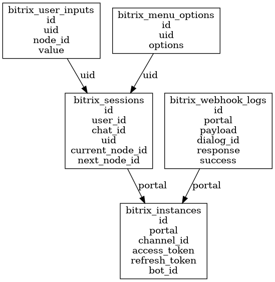

# Ánima ↔ Bitrix24 | Documentación Interna

## 🚀 Propósito

Integrar el motor conversacional de Ánima como chatbot en el Contact Center de Bitrix24 usando Laravel como backend puro. Permite automatizar respuestas desde un árbol de nodos y transferir al agente humano cuando sea necesario.

---

## 🔗 Arquitectura general

```json
Telegram/WhatsApp
       ⬇
     Bitrix24
       ⬇ (Webhook)
    Laravel (Webhook Controller)
       ⬇
BitrixFlowEngine → NodeProcessor
       ⬇                  ⬇
BitrixService     ÁnimaTreeService
                        ⬇
                     Árbol Ánima
```

---

## 🧩 Registro e instalación de la App en Bitrix24

### 📌 Pasos para configurar la aplicación local

1. Accede a https://[TU_PORTAL].bitrix24.mx/devops
2. Crea una nueva "Aplicación Local"
3. En la pestaña de "Permisos", activa:
   - `imbot`
   - `im`
   - `log`
4. Registra las URLs:
   - **Ruta de instalación inicial:** `https://TU_DOMINIO/api/v1.0.0/bitrix/oauth/authorize`
   - **Callback OAuth:** `https://TU_DOMINIO/api/v1.0.0/bitrix/oauth/callback`
   - **Webhook de salida:** `https://TU_DOMINIO/api/v1.0.0/webhook/bitrix/message`

---

## 📄 Documentación adicional

- Manual de instalación paso a paso en formato `.PDF:  
  👉 [Disponible en releases del repositorio](https://github.com/previsrl/apibot-bitrix-integration/releases)

---

## 🔹 Endpoints REST

### Webhook principal (entrada de mensajes desde Bitrix)

**Ruta:** `POST /api/v1.0.0/webhook/bitrix/message`

**Headers:**

- `Authorization: Bearer {BITRIX_AUTH_TOKEN}`

**Body esperado:**

```json
{
  "user_id": "bitrix_user_123",
  "channel_id": "telegrambot|1|...",
  "message": "Hola",
  "timestamp": "2024-04-22T12:00:00Z"
}
```

### Activar / desactivar bot por canal

**POST /api/v1.0.0/bitrix/bot-toggle**

```json
{
  "portal": "b24-demo.bitrix24.mx",
  "enabled": true
}
```

**GET /api/v1.0.0/bitrix/bot-status?portal=b24-demo.bitrix24.mx**

### Transferencia manual a humano

**POST /api/v1.0.0/bitrix/manual-transfer**

```json
{
  "chat_id": "7",
  "user_id": "user-b11"
}
```

### OAuth Bitrix24

- `GET /api/v1.0.0/bitrix/oauth/authorize`
- `GET /api/v1.0.0/bitrix/oauth/callback`

---

### Actualización de hash

**POST /api/v1.0.0/bitrix/update-hash**

```json
{
  "portal": "b24-35gg1t.bitrix24.mx",
  "hash": <hash>
}
```

## 🛠️ Instalación local

```bash
git clone https://github.com/previsrl/apibot-bitrix-integration.git
cd apibot-bitrix-integration
cp .env.example .env
composer install
php artisan migrate
php artisan serve
```

---

## 📊 Lógica conversacional

- `BitrixWebhookController.php` recibe los mensajes entrantes
- Se normaliza el payload
- Se evalúa el nodo actual desde `bitrix_sessions`
- `NodeProcessor.php` gestiona el tipo de nodo (`type_id`)
- `BitrixService.php` devuelve la respuesta a Bitrix

### Tipos de nodo soportados

| type_id | Tipo de nodo           |
| ------- | ---------------------- |
| 1       | Texto simple           |
| 2       | Menú de botones        |
| 3       | Botón simple           |
| 4       | Navegación             |
| 6       | Link externo           |
| 7       | Lenguaje natural (GPT) |
| 8       | Imagen                 |
| 9       | Video                  |
| 10      | Archivo                |
| 11      | Audio                  |
| 12      | Redirección            |
| 13      | Transferencia humana   |
| 14      | Input de texto         |
| 15      | HTTP externo           |

---

## 🔐 Seguridad

- Validación por `BITRIX_AUTH_TOKEN`
- Validación de `portal` y `channel_id`
- Campo `enabled` en `bitrix_instances`

---

## 📃 Base de datos clave

### `bitrix_instances`

- portal, hash, channel_id, bot_id, enabled

### `bitrix_sessions`

- user_id, chat_id, uid, current_node_id, transferred_to_human

### `bitrix_user_inputs`

- uid, node_id, value

### `bitrix_webhook_logs`

- portal, payload, response, dialog_id, success

---

## 📊 Diagrama ERD



---

## 🚨 Ejemplo de sesión conversacional

| Paso | Nodo ID | type_id | Mensaje / Acción                      |
| ---- | ------- | ------- | ------------------------------------- |
| 1    | 0       | 1       | ¡Hola! Bienvenido.                    |
| 2    | 1       | 8       | Mostrar imagen informativa            |
| 3    | 2       | 2       | Mostrar menú: \[Ver factura] \[Salir] |
| 4    | 3       | 3       | Usuario pulsa \[Ver factura]          |
| 5    | 4       | 15      | Llamada HTTP a API de facturas        |
| 6    | 5       | 13      | Transferencia a humano                |

---

## 🌐 Archivos clave del backend

- `BitrixWebhookController.php` → Entrada de mensajes
- `BitrixFlowEngine.php` → Motor conversacional
- `NodeProcessor.php` → Procesamiento por tipo
- `BitrixService.php` → Envío a Bitrix
- `AnimaTreeService.php` → Flujo del árbol Ánima
- `BitrixWebhookNormalizer.php`, `BitrixSessionHelper.php` → Funciones auxiliares

---

## 🎯 Pruebas rápidas (Postman)

POST a: `/api/v1.0.0/webhook/bitrix/message`

```json
{
  "user_id": "user-b11",
  "channel_id": "telegrambot|1|...",
  "message": "Hola"
}
```

---

### Actualizar `hash` conversacional para un portal

**POST /api/v1.0.0/bitrix/update-hash**

Este endpoint permite actualizar dinámicamente el árbol conversacional (`hash`) de una instancia Bitrix ya registrada.

**Headers:**

- `Authorization: Bearer {BITRIX_AUTH_TOKEN}`

**Body:**

```json
{
  "portal": "b24-demo.bitrix24.mx",
  "hash": "nuevo_hash_123"
}
```

---

## 🔐 Seguridad

- Validación por `BITRIX_AUTH_TOKEN`
- Validación de `portal` y `channel_id`
- Campo `enabled` en `bitrix_instances`
- Protección con middleware `verify.bitrix` para rutas sensibles como:
  - `/webhook/bitrix/message`
  - `/bitrix/update-hash`

---

## 🎯 Pruebas rápidas (Postman)

POST a: `/api/v1.0.0/webhook/bitrix/message`

```json
{
  "user_id": "user-b11",
  "channel_id": "telegrambot|1|...",
  "message": "Hola"
}
```

POST a: `/api/v1.0.0/bitrix/update-hash`

```json
{
  "portal": "b24-demo.bitrix24.mx",
  "hash": "nuevo_hash_123"
}
```

---

---

### 🧪 Gestión de Sesiones en Bitrix ↔ Ánima Bot

---

## 📦 Comandos Artisan personalizados

| Comando                                      | Descripción                                      |
| -------------------------------------------- | ------------------------------------------------ |
| `php artisan bitrix:register-bot`            | Registra el bot de Ánima en Bitrix como OpenLine |
| `php artisan bitrix:update-bot-openline`     | Actualiza el bot para habilitar OpenLine         |
| `php artisan bitrix:close-inactive-sessions` | Cierra sesiones con más de 24h inactivas         |

---

#### Cierre automático de sesiones inactivas

Las sesiones activas (`status = active`) con más de 24h de antigüedad se cierran con el comando:

```bash
php artisan bitrix:close-inactive-sessions
```

Este comando está registrado con `#[AsCommand]` y se ejecuta automáticamente cada hora gracias al método `schedule()` dentro de la misma clase:

```php
public function schedule(Schedule $schedule): void {
    $schedule->hourly();
}
```

---

#### Cierre de sesión al finalizar el flujo conversacional

Cuando un nodo de tipo `1` (Texto), `4` (Texto de navegación), o `15` (HTTP) no tiene hijos (`children`) ni redirecciones (`redirect_item`), se considera como nodo final del árbol. En ese caso, la sesión activa actual se cierra automáticamente:

```php
BitrixSession::where('uid', $uid)->update(['status' => 'closed']);
```

Esta lógica se aplica dentro de `NodeProcessor.php` mediante el método `evaluarCierreDeSesion()` que se ejecuta automáticamente después de procesar cada nodo.

---

#### Regeneración automática de sesiones cerradas o caducadas

El helper `BitrixSessionHelper::loadOrCreate()` se ha actualizado para manejar las sesiones de la siguiente forma:

- Si la sesión está `closed`, o si ha caducado (más de 24h desde su creación), se elimina por completo de la base de datos.
- Luego se genera un nuevo `uid` desde `AnimaTreeService` y se crea una nueva sesión con ese valor.

Esto permite que, si el usuario vuelve a escribir tras un tiempo o tras haber finalizado su flujo anterior, se le asigne un nuevo `uid` y se reinicie la conversación desde el nodo raíz.

---

## 🚀 Despliegue en Producción

Para poner en línea esta integración Laravel, se recomienda lo siguiente:

### 🔧 Requisitos del entorno

- PHP >= 8.2
- MySQL o MariaDB
- Composer
- Laravel 10 o superior
- Nginx o Apache con HTTPS
- Cuenta de Administrador en Bitrix

### 📦 Comandos esenciales

```bash
# Clonar el repositorio
git clone https://github.com/previsrl/apibot-bitrix-integration.git
cd apibot-bitrix-integration

# Copiar variables de entorno
cp .env.example .env

# Instalar dependencias y generar clave
composer install
php artisan key:generate

# Migrar base de datos
php artisan migrate
```
